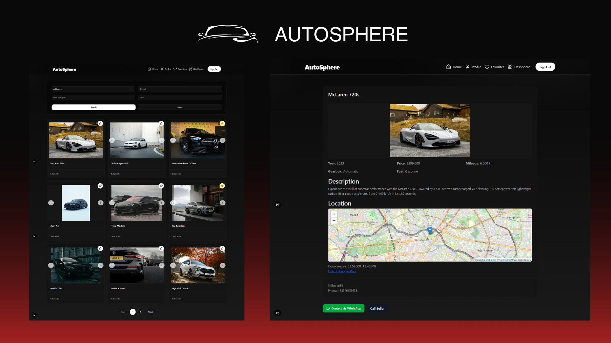

🚗 AutoSphere – Car Marketplace

AutoSphere is a modern, responsive car marketplace built with Next.js, Supabase, and TanStack Query. Users can browse, create, favorite, and manage car listings, view mini maps, and contact sellers via WhatsApp or call.

✨ Features

Car Listings: Create/edit listings with brand, model, year, price, mileage, gearbox, fuel type, description, and precise location (lat/lng).
Image Uploads: Multiple images stored in Supabase Storage, displayed in a responsive carousel.
Home Feed & Filters: Filter by brand/model/year/mileage, with instant caching via TanStack Query.
Favorites: Save cars and view them in a dedicated favorites page.
Seller Dashboard: Manage your listings (edit/delete) with pagination.
Car Detail: Carousel, specs, description, mini map, WhatsApp/Call buttons.
Profile: Update name, role, and phone in E.164 format, with one-click application to all listings.
Auth & UX: Supabase Auth, smooth Tailwind CSS UI, loading states, and reactive toasts.

🛠 Tech Stack

Frontend: Next.js 15, React 19, TypeScript, Tailwind CSS, shadcn/ui
Backend: Supabase (Postgres, Auth, Storage)
Data Fetching: TanStack Query
UI/Icons: lucide-react, sonner (toasts)
Maps: OpenStreetMap iframes

🚀 Quick Start
Prerequisites

Node.js 18+
Supabase project with Storage bucket car-images
Setup
git clone <repo-url>
cd autosphere
npm install

Create .env.local:
NEXT_PUBLIC_SUPABASE_URL=your_supabase_project_url
NEXT_PUBLIC_SUPABASE_ANON_KEY=your_supabase_anon_key

Database (Supabase SQL)
-- Cars table
create table public.cars (
  id uuid primary key default gen_random_uuid(),
  brand text not null,
  model text not null,
  year int,
  price numeric,
  mileage int,
  gearbox text,
  fuel_type text,
  description text,
  location_lat double precision,
  location_lng double precision,
  seller_id uuid not null references auth.users(id) on delete cascade,
  seller_username text,
  seller_phone text,
  created_at timestamptz default now(),
  updated_at timestamptz default now()
);

-- Favorites
create table public.favorites (
  user_id uuid not null references auth.users(id) on delete cascade,
  car_id uuid not null references public.cars(id) on delete cascade,
  created_at timestamptz default now(),
  primary key(user_id, car_id)
);

-- Car images
create table public.car_images (
  id bigserial primary key,
  car_id uuid not null references public.cars(id) on delete cascade,
  path text not null,
  created_at timestamptz default now()
);

Run Locally
npm run dev

Open http://localhost:3000

Build & Production
npm run build
npm start

📖 Usage

Auth: Sign up/login, reset password via Supabase
Profile: Select country code, enter subscriber digits → saved as E.164 (+38345123456)
Create/Edit Car: Add description, location, and images
Browse Listings: Filter by brand/model/year/mileage, favorite cars
Car Detail: View images, specs, mini map, contact via WhatsApp or call

☁️ Deployment
Vercel:
Push repo to GitHub
Import project in Vercel
Add env vars: NEXT_PUBLIC_SUPABASE_URL, NEXT_PUBLIC_SUPABASE_ANON_KEY

Deploy
Other providers: Same steps; ensure npm run build is supported.

🐞 Troubleshooting

Phone issues: Must be E.164 format (+ followed by 8–15 digits).
WhatsApp button not working: Ensure seller_phone is correctly saved.
Map not showing: Listing must have location_lat and location_lng.
Images missing: Ensure car-images bucket exists and is publicly readable or use signed URLs.
Brand filter errors: Use sentinel "ALL" for default option.
